# 按钮

按钮控件用于触发操作或命令。

## 普通按钮 (PushButton)

<div align="center">
  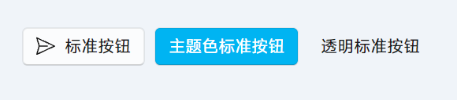
</div>

```xml
<ui:PushButton Content="标准按钮" IconSource="{x:Static fi:FluentIcon.Send}"/>
<ui:PushButton Classes="Accent" Content="主题色标准按钮"/>
<ui:PushButton Content="透明标准按钮" Classes="Transparent"/>
```

## 工具按钮 (ToolButton)

只显示图标的按钮，通常用于工具栏。

<div align="center">
  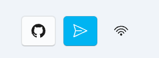
</div>

```xml
<ui:ToolButton Content="{x:Static fi:FluentIcon.GitHub}"/>
<ui:ToolButton Classes="Accent" Content="{x:Static fi:FluentIcon.Send}"/>
<ui:ToolButton Content="{x:Static fi:FluentIcon.Wifi}" Classes="Transparent"/>
```

## 圆角按钮

<div align="center">
  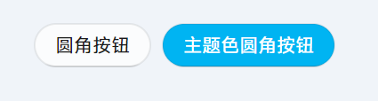
</div>

```xml
<ui:PushButton
      Classes="Round"
      Content="圆角按钮"
      IconSource="{StaticResource Send}"/>
    <ui:PushButton Classes="Accent Round" Content="主题色圆角按钮"/>
```

## 圆角工具按钮

<div align="center">
  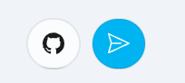
</div>

```xml
<ui:ToolButton Classes="Round" Content="{x:Static fi:FluentIcon.GitHub}"/>
<ui:ToolButton Classes="Accent Round" Content="{x:Static fi:FluentIcon.Send}"/>
```

## 轮廓按钮

<div align="center">
  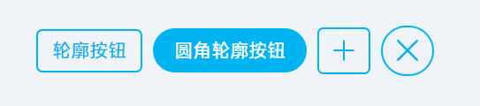
</div>

```xml
<ui:PushButton Classes="Outlined" Content="轮廓按钮"/>
<ui:PushButton Classes="Outlined Round" Content="圆角轮廓按钮"/>
<ui:ToolButton Classes="Outlined" Content="{x:Static fi:FluentIcon.Add}"/>
<ui:ToolButton Classes="Outlined Round" Content="{x:Static fi:FluentIcon.Close}"/>
```

## 填充按钮 (FilledPushButton)

带背景填充的按钮样式。

<div align="center">
  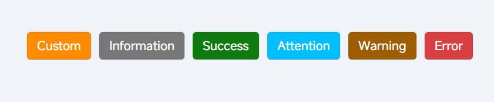
</div>

```xml
<ui:FilledPushButton Content="Custom" Background="DarkOrange"/>
<ui:FilledPushButton Content="Information" Classes="Information"/>
<ui:FilledPushButton Classes="Success" Content="Success"/>
<ui:FilledPushButton Classes="Attention" Content="Attention"/>
<ui:FilledPushButton Classes="Warning" Content="Warning"/>
<ui:FilledPushButton Classes="Error" Content="Error"/>
```

## 填充工具按钮 (FilledToolButton)

<div align="center">
  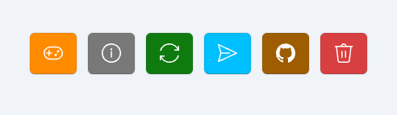
</div>

```xml
<ui:FilledToolButton Content="{x:Static fi:FluentIcon.Game}" Background="DarkOrange"/>
<ui:FilledToolButton Content="{x:Static fi:FluentIcon.Info}" Classes="Information"/>
<ui:FilledToolButton Classes="Success" Content="{x:Static fi:FluentIcon.Sync}"/>
<ui:FilledToolButton Classes="Attention" Content="{x:Static fi:FluentIcon.Send}"/>
<ui:FilledToolButton Classes="Warning" Content="{x:Static fi:FluentIcon.GitHub}"/>
<ui:FilledToolButton Classes="Error" Content="{x:Static fi:FluentIcon.Delete}"/>
```

## 描边按钮 (OutlinePushButton)

#### 加入不同的组可启用单选多选功能

<div align="center">
  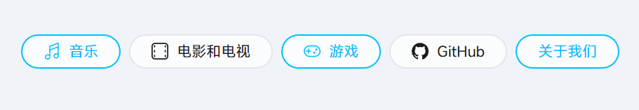
</div>

```xml
<StackPanel Orientation="Horizontal" Spacing="8">
  <ui:OutlinePushButton
    Content="音乐"
    Group="{Binding MainGroup}"
    IconSource="{x:Static fi:FluentIcon.Music}"
    Tag="Music"/>
  <ui:OutlinePushButton
    Content="电影和电视"
    Group="{Binding MainGroup}"
    IconSource="{x:Static fi:FluentIcon.Video}"
    Tag="Video"/>
  <ui:OutlinePushButton
    Content="游戏"
    Group="{Binding MainGroup}"
    IconSource="{x:Static fi:FluentIcon.Game}"
    Tag="Game"/>
  <ui:OutlinePushButton
    Content="GitHub"
    Group="{Binding MainGroup}"
    IconSource="{x:Static fi:FluentIcon.GitHub}"
    Tag="GitHub"/>
  <ui:OutlinePushButton
    Content="关于我们"
    Group="{Binding MainGroup}"
    Tag="About"/>
</StackPanel>
```

```csharp

public OutlineButtonGroup MainGroup { get; } = new OutlineButtonGroup();

// 设置选择模式
MainGroup.SelectionMode = OutlineButtonSelectionMode.Multiple;

MainGroup.SelectionChanged += g =>
{
    if (g.SelectionMode == OutlineButtonSelectionMode.Single)
    {
        Console.WriteLine($"Single Selected Item: {g.SelectedItem.Tag}");
    }
    else
    {
        foreach (var btn in g.SelectedItems)
        {
            Console.WriteLine($"Multiple Selected Item: {btn.Tag}");
        }
    }
};


```


## 描边工具按钮 (OutlinedToolButton)

* 使用方法和 `OutlinedPushButton`一致

<div align="center">
  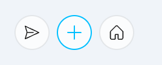
</div>

```xml
<ui:OutlineToolButton Content="{x:Static fi:FluentIcon.Send}"/>
<ui:OutlineToolButton Content="{x:Static fi:FluentIcon.Add}"/>
<ui:OutlineToolButton Content="{x:Static fi:FluentIcon.Home}"/>
```

## 胶囊单选按钮

<div align="center">
  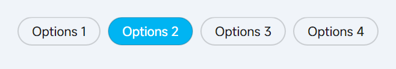
</div>

```xml
<RadioButton Content="Options 1" Theme="{StaticResource ChipsRadioButton}"/>
<RadioButton Content="Options 2" Theme="{StaticResource ChipsRadioButton}"/>
<RadioButton Content="Options 3" Theme="{StaticResource ChipsRadioButton}"/>
<RadioButton Content="Options 4" Theme="{StaticResource ChipsRadioButton}"/>
```

## 带子标题的单选按钮 (SubTitleRadioButton)
<div align="center">
  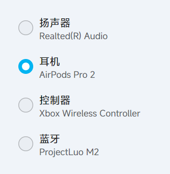
</div>

```xml
<ui:SubTitleRadioButton Content="扬声器" SubTitle="Realted(R) Audio"/>
<ui:SubTitleRadioButton Content="耳机" SubTitle="AirPods Pro 2"/>
<ui:SubTitleRadioButton Content="控制器" SubTitle="Xbox Wireless Controller"/>
<ui:SubTitleRadioButton Content="蓝牙" SubTitle="ProjectLuo M2"/>
```

## 下拉按钮 (DropDownButton)

* 透明下拉按钮 `Classes="Transparent"`

<div align="center">
  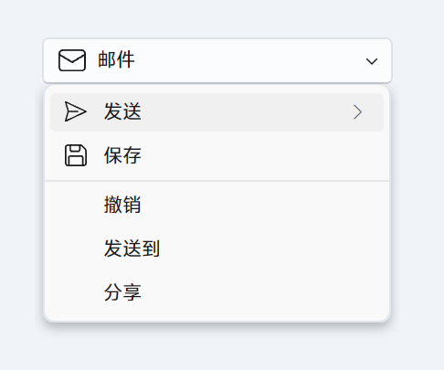
</div>


```xml
<DropDownButton Width="256">
  <Grid ColumnDefinitions="Auto, *" ColumnSpacing="8">
    <PathIcon Data="{x:Static fi:FluentIcon.Mail}"/>
    <TextBlock Grid.Column="1" Text="邮件"/>
  </Grid>
  <DropDownButton.Flyout>
    <ui:FluentMenuFlyout>
      <MenuItem Header="发送">
        <MenuItem.Icon>
          <PathIcon Data="{x:Static fi:FluentIcon.Send}"/>
        </MenuItem.Icon>
        <MenuItem.Items>
          <MenuItem Header="删除"/>
          <MenuItem Header="新建"/>
        </MenuItem.Items>
      </MenuItem>
      <MenuItem Header="保存">
        <MenuItem.Icon>
          <PathIcon Data="{x:Static fi:FluentIcon.Save}"/>
        </MenuItem.Icon>
      </MenuItem>
      <Separator HorizontalAlignment="Stretch"/>
      <MenuItem Header="撤销"/>
      <MenuItem Header="发送到"/>
      <MenuItem Header="分享"/>
    </ui:FluentMenuFlyout>
  </DropDownButton.Flyout>
</DropDownButton>
```