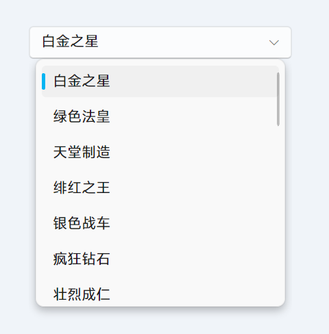

# 下拉框


## 下拉框 (ComboBox)

<div align="center">
  
</div>

```xml
<ComboBox Width="256" ItemsSource="{Binding Items}" SelectedIndex="0" MaxDropDownHeight="256"></ComboBox>
```

## 多选下拉框 (MultiSelectionComboBox)

<div align="center">
  
</div>

```xml
<ui:MultiSelectionComboBox Width="328" ItemsSource="{Binding Items}"></ui:MultiSelectionComboBox>
```